# 🛒 EasyShop – End-to-End DevSecOps & GitOps Architecture

<p align="center">

        

</p>

<p align="center">
  <b>End-to-End DevSecOps • CI/CD • GitOps • AWS EKS • Kubernetes • Monitoring</b>
</p>

---

## 📌 Project Overview

**EasyShop** is an end-to-end DevSecOps and GitOps implementation of a containerized e-commerce application deployed on **AWS EKS**.

The project automates infrastructure provisioning, application containerization, CI, security scanning, Docker image publishing, Kubernetes manifest updates, and GitOps-based deployment using **Argo CD**.

The application is exposed through **NGINX Ingress**, secured with **Let's Encrypt HTTPS**, and monitored using **Prometheus and Grafana**.

---

## 🔄 High-Level Flow

```text
Developer
    │
    ▼
GitHub Repository
    │
    ▼
Jenkins CI Pipeline
    │
    ├── Clone Repository
    ├── Build Docker Images
    ├── Run Test
    ├── Trivy Security Scan
    ├── Push Images to Docker Hub
    └── Update Kubernetes Manifests
             │
             ▼
       GitHub Kubernetes Manifests
             │
             ▼
          Argo CD
             │
             ▼
        AWS EKS Cluster
             │
       ┌─────┴─────┐
       ▼           ▼
   Kubernetes   MongoDB
       │
       ▼
NGINX Ingress
       │
       ▼
HTTPS Domain
```

---

# 🏗️ Architecture

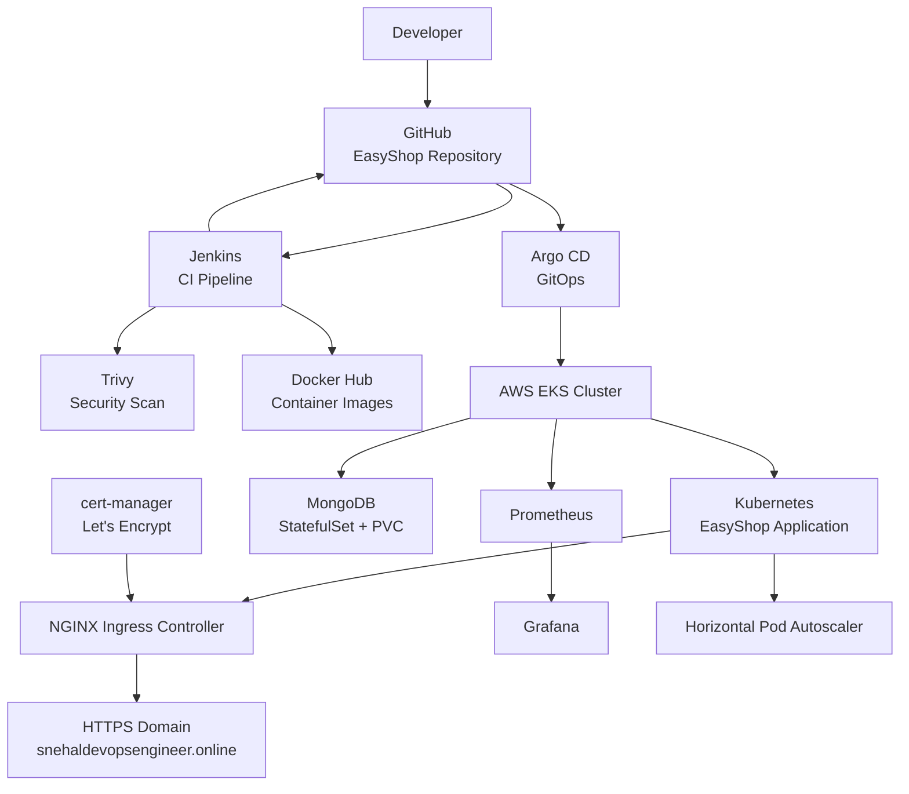

---

# 🛠️ Tech Stack

| Category               | Technologies                 |
| ---------------------- | ---------------------------- |
| Cloud                  | AWS                          |
| Infrastructure as Code | Terraform                    |
| Containerization       | Docker                       |
| Container Registry     | Docker Hub                   |
| CI                     | Jenkins                      |
| Security Scanning      | Trivy                        |
| Orchestration          | Kubernetes / AWS EKS         |
| GitOps                 | Argo CD                      |
| Ingress                | NGINX Ingress Controller     |
| TLS                    | cert-manager + Let's Encrypt |
| Monitoring             | Prometheus                   |
| Visualization          | Grafana                      |
| Autoscaling            | Kubernetes HPA               |
| Database               | MongoDB                      |
| Application            | Next.js / TypeScript         |
| Source Control         | GitHub                       |

---

# ✨ Project Features

* ☁️ AWS infrastructure provisioned using Terraform
* 🏗️ VPC and EKS cluster provisioning
* ⚙️ Jenkins CI pipeline
* 🐳 Docker containerization
* 🔐 Trivy container security scanning
* 📦 Docker Hub image publishing
* ☸️ Kubernetes deployment on AWS EKS
* 🔄 Argo CD GitOps deployment
* 🌐 NGINX Ingress Controller
* 🔒 HTTPS using Let's Encrypt
* 📈 Horizontal Pod Autoscaling
* 📊 Prometheus monitoring
* 📉 Grafana dashboards
* 🗄️ MongoDB StatefulSet with persistent storage
* 🔧 Automated tool installation using EC2 user-data

---

# 📂 Repository

```bash
git clone https://github.com/snehalpawar29/EasyShop.git
cd EasyShop
```

---

# 🚀 Setup & Initialization

## 1️⃣ Install Terraform

Install Terraform on your local machine.

Verify:

```bash
terraform --version
```

---

## 2️⃣ Clone Repository

```bash
git clone https://github.com/snehalpawar29/EasyShop.git
cd EasyShop/terraform
```

---

### From the next step onward, connect to the Bastion / EC2 server.

---

# 5️⃣ Tool Installation

Terraform provisions the EC2 server and installs the required tools using the `install_tools.sh` user-data script.

Installed tools:

* Java
* Jenkins
* Docker
* Trivy
* AWS CLI
* Helm
* kubectl
* Argo CD CLI

---

# 6️⃣ Docker Images

Jenkins builds and pushes:

```text
snehalpawar2945/easyshop:<BUILD_NUMBER>
snehalpawar2945/easyshop-migration:<BUILD_NUMBER>
```

---

# 7️⃣ Terraform Infrastructure

Go to the Terraform directory:

```bash
cd EasyShop/terraform
```

Generate SSH key:

```bash
ssh-keygen -f terra-key
```

Set permission:

```bash
chmod 400 terra-key
```

Initialize Terraform:

```bash
terraform init
```

Validate configuration:

```bash
terraform validate
```

Create execution plan:

```bash
terraform plan
```

Apply infrastructure:

```bash
terraform apply
```

Type:

```text
yes
```

---

# 8️⃣ Connect to Bastion Host

```bash
ssh -i terra-key ubuntu@<BASTION-IP>
```

---

# 9️⃣ Configure AWS

```bash
aws configure
```

Verify:

```bash
aws --version
```

---

# 🔟 Connect kubectl to EKS

```bash
aws eks --region ap-south-1 update-kubeconfig --name easyshop-cluster
```

Check cluster nodes:

```bash
kubectl get nodes
```

---

# 🔵 Jenkins Setup

Check Jenkins:

```bash
sudo systemctl status jenkins
```

Get the initial Jenkins password:

```bash
sudo cat /var/lib/jenkins/secrets/initialAdminPassword
```

Open Jenkins:

```text
http://<BASTION-IP>:8080
```

---

## Jenkins Plugins

Install:

* Docker Pipeline
* Pipeline View

---

# 🔑 Jenkins Credentials

Go to:

```text
Manage Jenkins
→ Credentials
→ Global
→ Add Credentials
```

### GitHub

```text
ID: github-credentials
```

### Docker Hub

```text
ID: docker-hub-credentials
```

---

# 📚 Jenkins Shared Library

Go to:

```text
Manage Jenkins
→ System
→ Global Pipeline Libraries
```

Configure:

```text
Name: shared
Default version: main
```

Repository:

```text
https://github.com/snehalpawar29/jenkins-shared-libraries.git
```

---

# 🔧 Jenkins Pipeline

Create a Pipeline job:

```text
New Item
→ EasyShop
→ Pipeline
```

GitHub Project URL:

```text
https://github.com/snehalpawar29/EasyShop.git
```

Enable:

```text
GitHub hook trigger for GITScm polling
```

Configure Pipeline:

```text
Definition:
Pipeline script from SCM

SCM:
Git

Repository:
https://github.com/snehalpawar29/EasyShop.git

Branch:
main

Script Path:
Jenkinsfile
```

---

# 🔄 CI/CD & GitOps Workflow

## Jenkins CI

```text
Cleanup Workspace
        ↓
Clone Repository
        ↓
Build Docker Images
        ↓
Run Test
        ↓
Trivy Security Scan
        ↓
Push Docker Images
        ↓
Update Kubernetes Manifests
```

## Argo CD GitOps

```text
GitHub
   ↓
Argo CD
   ↓
AWS EKS
   ↓
Kubernetes
```

Argo CD monitors the Kubernetes manifests stored in Git and synchronizes them with the EKS cluster.

---

# 🟣 Argo CD Setup

Create namespace:

```bash
kubectl create namespace argocd
```

Install Argo CD:

```bash
kubectl apply -n argocd \
-f https://raw.githubusercontent.com/argoproj/argo-cd/stable/manifests/install.yaml
```

Check pods:

```bash
kubectl get pods -n argocd
```

Watch pods:

```bash
kubectl get pods -n argocd -w
```

Check services:

```bash
kubectl get svc -n argocd
```

---

## Argo CD NodePort

Patch Argo CD server:

```bash
kubectl patch svc argocd-server -n argocd \
-p '{"spec":{"type":"NodePort"}}'
```

Check service:

```bash
kubectl get svc argocd-server -n argocd
```

Get Argo CD password:

```bash
kubectl -n argocd get secret argocd-initial-admin-secret \
-o jsonpath="{.data.password}" | base64 -d
```

Access:

```text
https://<WORKER-IP>:<NODEPORT>
```

Login:

```text
Username: admin
Password: <Argo-CD-password>
```

---

# 📦 Argo CD Application

In the Argo CD GUI:

```text
New App
```

Configure:

```text
Application Name:
easyshop

Project:
default

Sync Policy:
Automatic
```

Repository:

```text
https://github.com/snehalpawar29/EasyShop.git
```

Path:

```text
kubernetes
```

Destination:

```text
https://kubernetes.default.svc
```

Namespace:

```text
easyshop-ns
```

Create the application.

Check:

```bash
kubectl get applications -n argocd
```

---

# ☸️ Kubernetes Application

Create namespace:

```bash
kubectl apply -f kubernetes/namespace.yml
```

Kubernetes resources:

```text
Namespace
Deployment
Service
Migration Job
MongoDB StatefulSet
PersistentVolume
PersistentVolumeClaim
ConfigMap
Secret
HPA
Ingress
ClusterIssuer
```

---

# 🌐 NGINX Ingress Controller

Add Helm repository:

```bash
helm repo add ingress-nginx https://kubernetes.github.io/ingress-nginx
```

Update:

```bash
helm repo update
```

Install:

```bash
helm install nginx-ingress ingress-nginx/ingress-nginx
```

Check pods:

```bash
kubectl get pods
```

Check service:

```bash
kubectl get svc
```

Check ingress:

```bash
kubectl get ingress -n easyshop-ns
```

---

# 🔒 HTTPS with cert-manager

Add Jetstack repository:

```bash
helm repo add jetstack https://charts.jetstack.io
```

Update:

```bash
helm repo update
```

Install cert-manager:

```bash
helm install cert-manager jetstack/cert-manager \
--namespace cert-manager \
--create-namespace \
--set crds.enabled=true
```

Check pods:

```bash
kubectl get pods -n cert-manager
```

Check ClusterIssuer:

```bash
kubectl get clusterissuer
```

Check certificate:

```bash
kubectl get certificate -n easyshop-ns
```

Check certificate request:

```bash
kubectl get certificaterequest -n easyshop-ns
```

Check challenges:

```bash
kubectl get challenge -n easyshop-ns
```

Check cert-manager logs:

```bash
kubectl logs -n cert-manager deployment/cert-manager
```

---

# 🌍 EasyShop Domain

```text
https://snehaldevopsengineer.online
```

---

# 📊 Prometheus & Grafana Monitoring

Add Prometheus Helm repository:

```bash
helm repo add prometheus-community \
https://prometheus-community.github.io/helm-charts
```

Update:

```bash
helm repo update
```

Install:

```bash
helm install prometheus prometheus-community/kube-prometheus-stack \
--namespace monitoring \
--create-namespace
```

Check:

```bash
kubectl get pods -n monitoring
```

---

# 🔴 Prometheus

Check service:

```bash
kubectl get svc -n monitoring
```

Expose Prometheus using NodePort:

```bash
kubectl edit svc prometheus-kube-prometheus-prometheus -n monitoring
```

Change:

```yaml
type: ClusterIP
```

to:

```yaml
type: NodePort
```

Check:

```bash
kubectl get svc -n monitoring
```

Access:

```text
http://<WORKER-IP>:<PROMETHEUS-NODEPORT>
```

---

# 🟠 Grafana

Check service:

```bash
kubectl get svc -n monitoring
```

Expose Grafana using NodePort:

```bash
kubectl edit svc prometheus-grafana -n monitoring
```

Change:

```yaml
type: ClusterIP
```

to:

```yaml
type: NodePort
```

Check:

```bash
kubectl get svc -n monitoring
```

Get Grafana password:

```bash
kubectl get secret prometheus-grafana \
-n monitoring \
-o jsonpath="{.data.admin-password}" | base64 -d
```

Access:

```text
http://<WORKER-IP>:<GRAFANA-NODEPORT>
```

Login:

```text
Username: admin
Password: <Grafana-password>
```

---

# 📈 Metrics Server

Check Metrics Server:

```bash
kubectl get pods -n kube-system | grep metrics
```

Check node metrics:

```bash
kubectl top nodes
```

Check pod metrics:

```bash
kubectl top pods -n easyshop-ns
```

---

# ⚡ Horizontal Pod Autoscaler

Check HPA:

```bash
kubectl get hpa -n easyshop-ns
```

Configuration:

```text
Minimum Replicas: 2
Maximum Replicas: 5
CPU Target: 70%
```

Detailed status:

```bash
kubectl describe hpa easyshop-hpa -n easyshop-ns
```

---

# ✅ Kubernetes Verification

```bash
kubectl get nodes
```

```bash
kubectl get pods -n easyshop-ns
```

```bash
kubectl get svc -n easyshop-ns
```

```bash
kubectl get ingress -n easyshop-ns
```

```bash
kubectl get certificate -n easyshop-ns
```

```bash
kubectl get hpa -n easyshop-ns
```

```bash
kubectl top nodes
```

```bash
kubectl get applications -n argocd
```

---

# 📸 Project Screenshots

## AWS Infrastructure

### AWS VPC


### EKS Cluster


### EKS Nodes

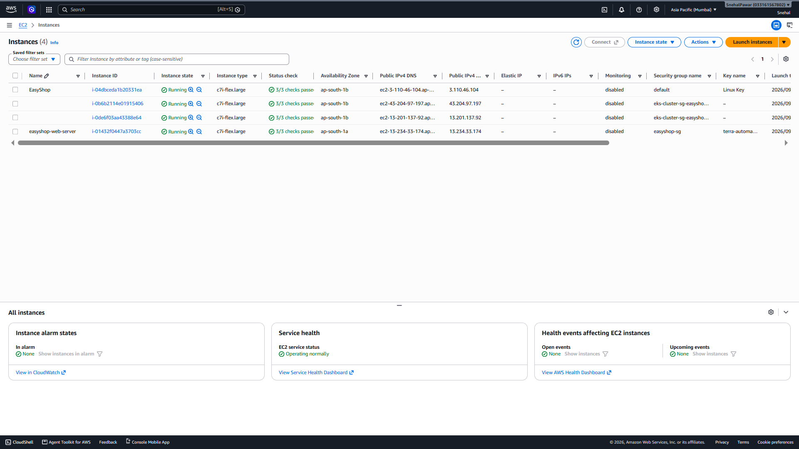

---

## 🐳 Docker

### EasyShop Docker Image


### Migration Docker Image


---

## 🔧 Jenkins

### Jenkins Dashboard

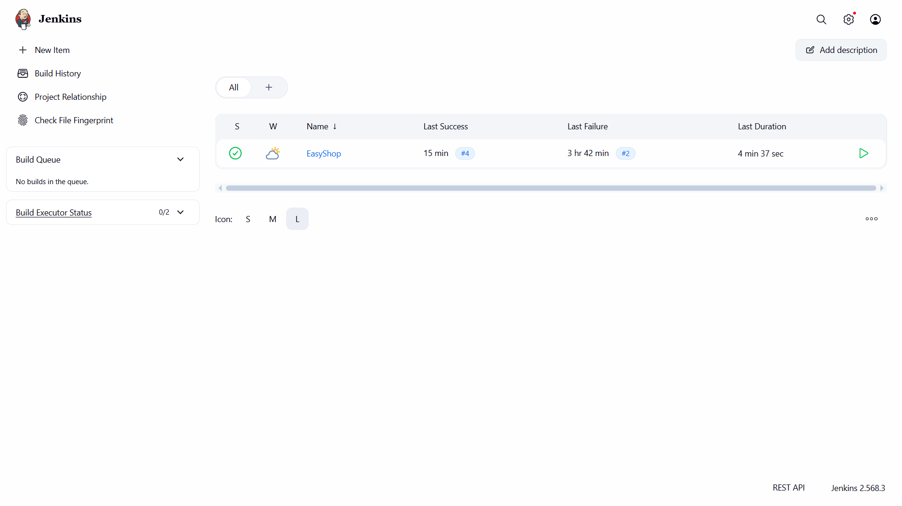

### Jenkins Credentials

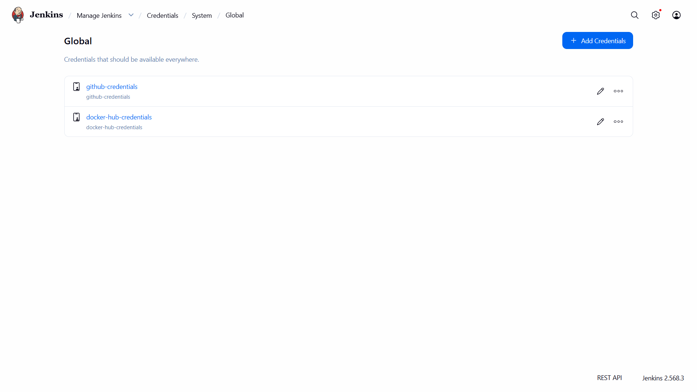

### Jenkins Pipeline Stages


### Jenkins Pipeline Success

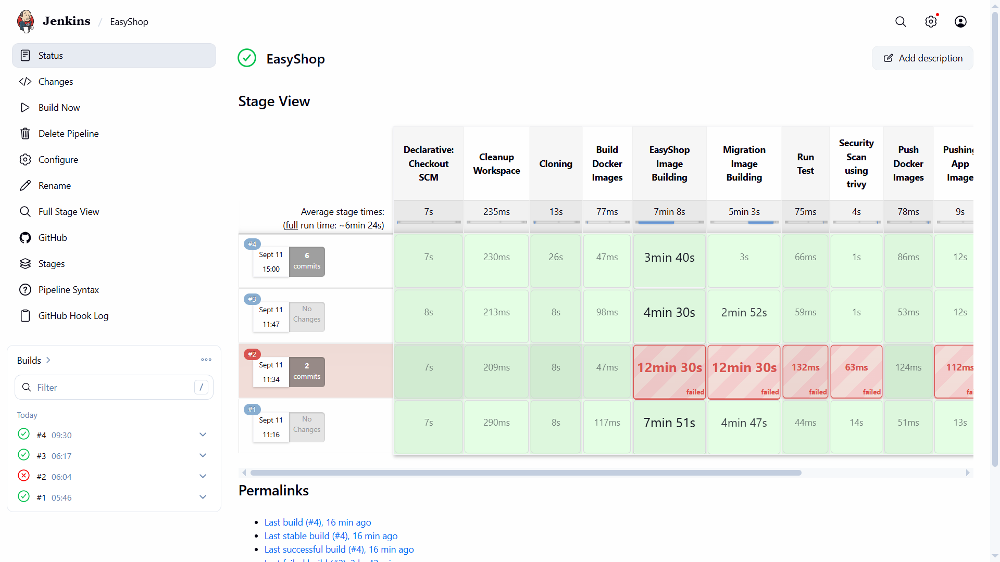

---

## ☸️ Kubernetes

### Kubernetes Nodes

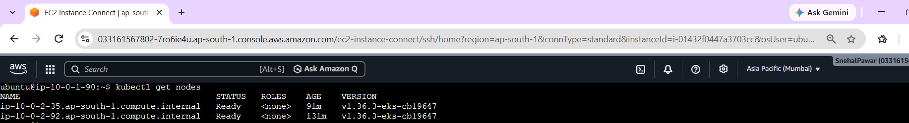

### EasyShop Pods


### EasyShop Services

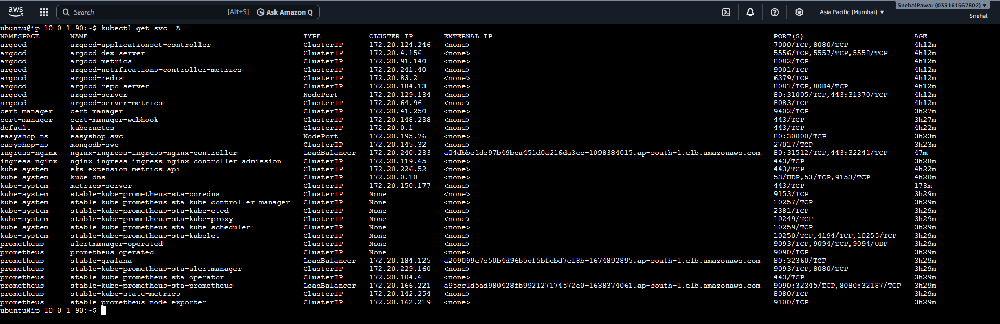

### Kubernetes Resources

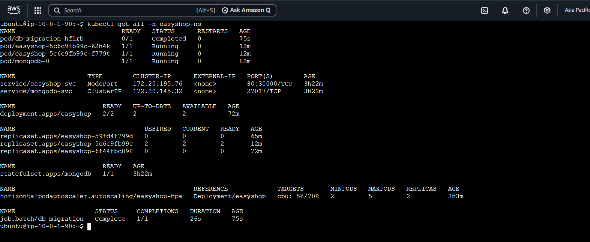

### Top Pods

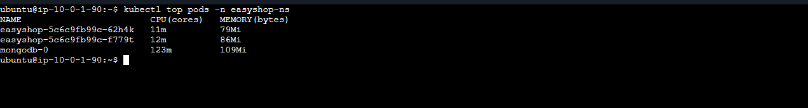

---

## 🔄 Argo CD

### Argo CD Application

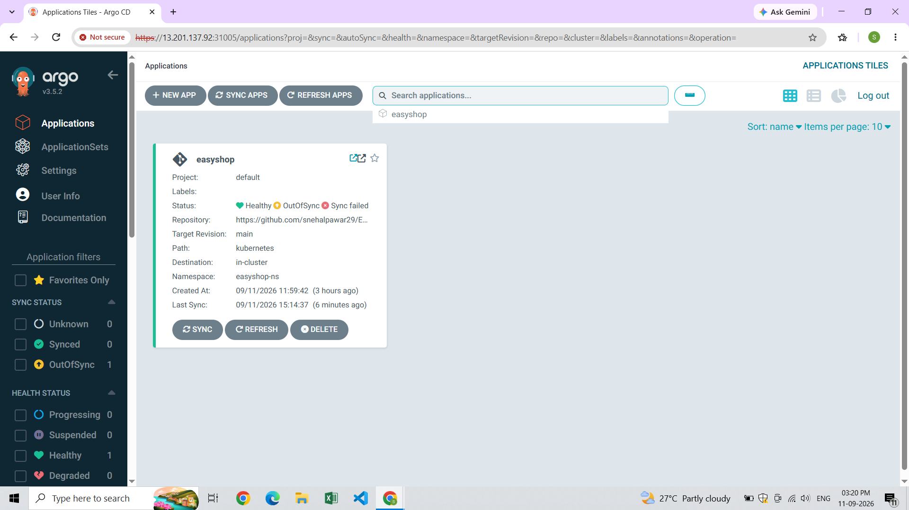

### Argo CD Resource Tree


---

## 🌐 Ingress & HTTPS

### NGINX Ingress


### HTTPS Domain


### Let's Encrypt Certificate


---

## 📊 Monitoring

### Prometheus Overview


### Prometheus Targets

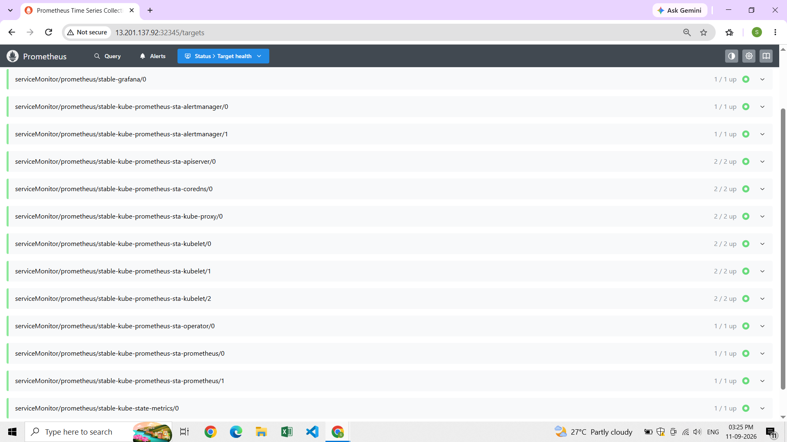

### Grafana Kubernetes Nodes


### Grafana Kubernetes Pods


### Grafana Kubernetes Workloads

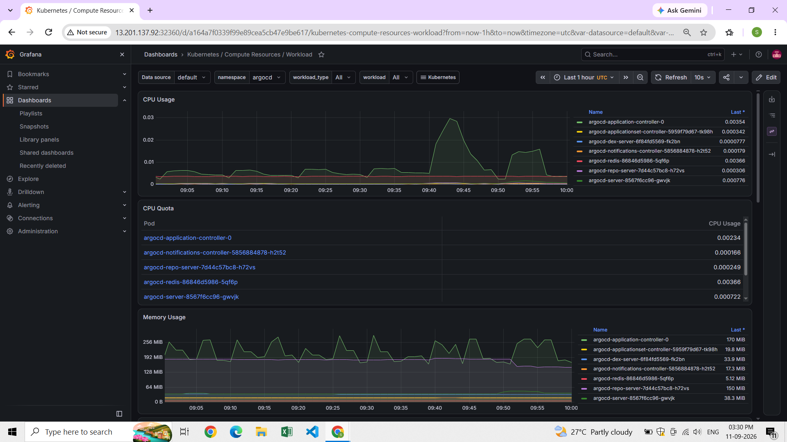

### Grafana Node Exporter


---

## ⚡ HPA

### HPA Status


---

# 🧹 Clean Up

Since the AWS infrastructure is managed using Terraform:

```bash
terraform destroy
```

Review the resources before confirming the destruction.

> **Note:** Persistent MongoDB data and externally created resources such as Helm-managed services may require separate cleanup depending on how they were created.

---

# 🔐 Security

The project includes:

* Trivy container image scanning
* Kubernetes Secrets
* HTTPS using Let's Encrypt
* AWS IAM
* AWS Security Groups
* Private Kubernetes workloads
* GitOps-based deployment with Argo CD

> **Important:** Never commit real passwords, API keys, JWT secrets, or other credentials to GitHub. Use environment variables, Kubernetes Secrets, or an external secrets-management solution.

---

# 📌 Current Security & Production Considerations

This project is **production-oriented / production-style** for learning and portfolio purposes.

Before using the architecture for a real production environment, additional hardening should be applied to:

* Kubernetes and application secrets
* EKS API endpoint access
* Public NodePort exposure
* EC2 security-group rules
* MongoDB production architecture
* Worker-node capacity strategy
* IAM permissions
* Network security and access controls

---
